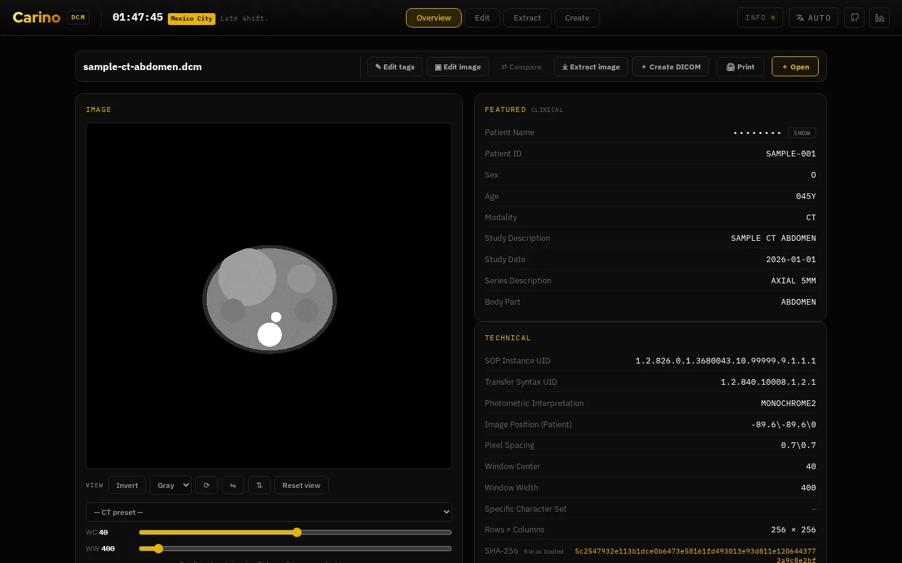
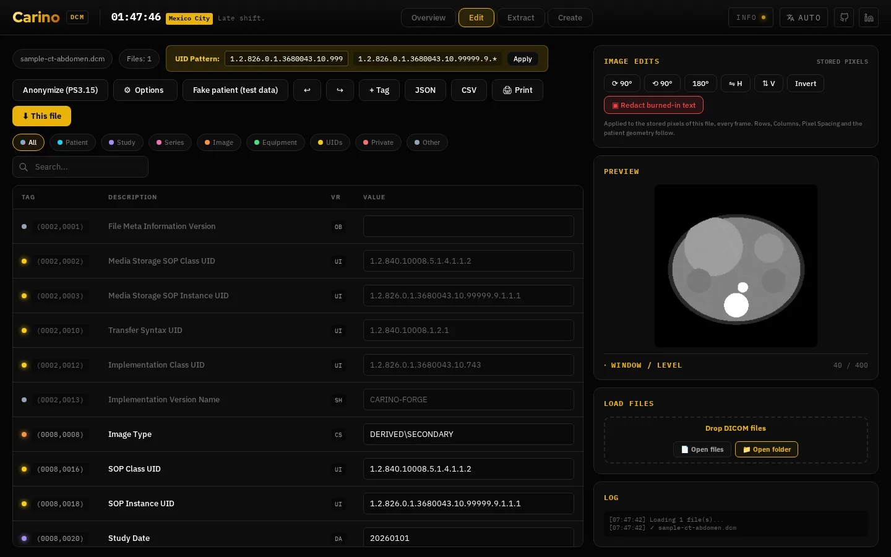
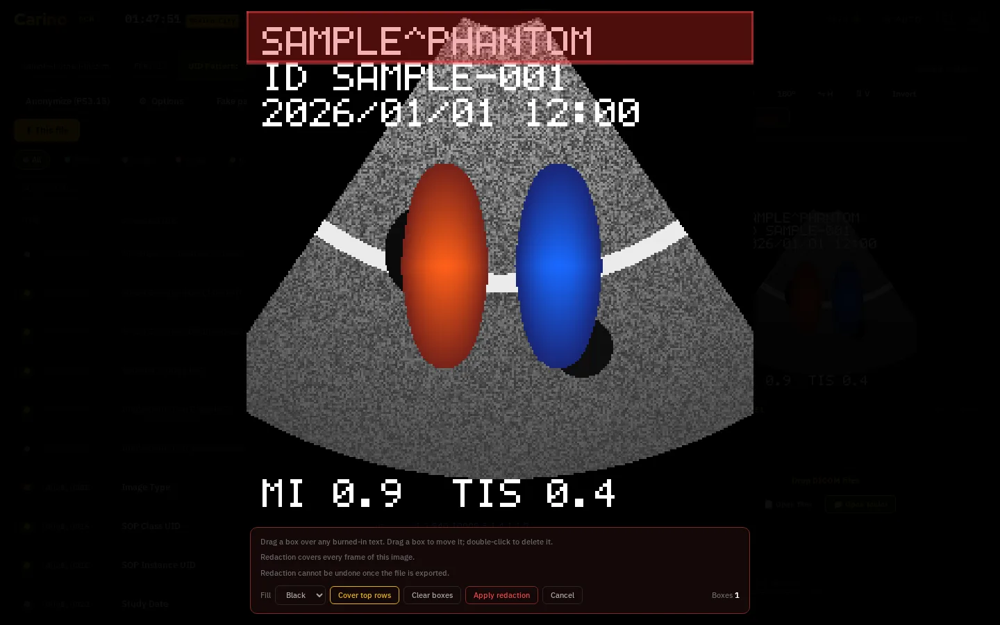
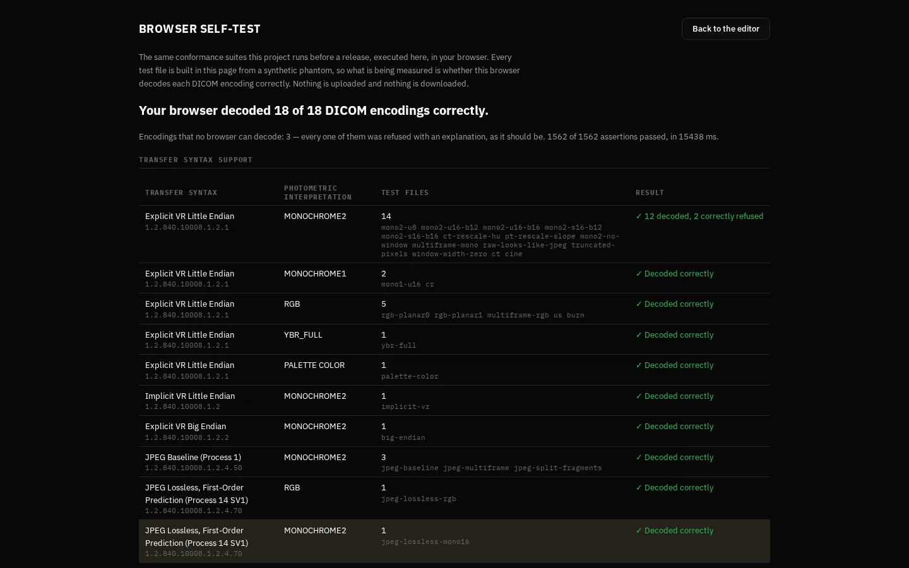

# Carino DICOM Editor

View, edit, create, compare, validate and **de-identify** DICOM files in the browser.
Nothing is uploaded and there is no server. **[dcm.carino.systems](https://dcm.carino.systems)**

It is a static page (`index.html`, `app.css`, plain scripts in `js/`) built on
[dcmjs](https://github.com/dcmjs-org/dcmjs), with no build step. The repository used to
be called `DICOM-editor`; GitHub redirects the old name.



## What it does

- **View**: drop a file or folder. Files are sorted by series and instance number. The
  wheel moves through the series, Ctrl/⌘+wheel zooms, and window/level stays the same as
  you scroll. Multi-frame files play as cine.
- **Edit tags**: every attribute in an editable table, with undo/redo and JSON/CSV
  export. The full PS3.6 dictionary is bundled, so every standard tag has a name.
- **Edit image**: rotate, flip, invert and redact the **stored pixels**, not just the view.
  Nothing is resampled. Rows/Columns, pixel spacing and patient geometry are updated to
  match, and the file is marked `DERIVED` with a new SOP Instance UID.
- **De-identify**: **Anonymize** applies the PS3.15 Basic Confidentiality Profile.
  **Fake patient** fills in made-up demographics for test data.
- **Compare, Extract, Create**: diff two files, export frames as PNG/JPEG, or build a new
  DICOM file from scratch.



## Trying it without a file

The empty page has five **samples** that are generated in the browser. None of them is a
real patient.

| Sample | What it tests |
| --- | --- |
| CT abdomen | signed 16-bit pixels, rescale, a window in Hounsfield units |
| Chest X-ray | `MONOCHROME1` inversion |
| Ultrasound | interleaved RGB |
| Cine loop | 16 frames at 30 fps |
| Burned-in text | patient details drawn into the pixels |

`#sample=<id>` opens a sample directly, and `#case=<id>` opens any case from the test
corpus. The [reference gallery](https://dcm.carino.systems/tests/gallery.html) uses
these links.

## De-identification

**Anonymize** follows **PS3.15 Annex E, Table E.1-1**. The rules for 656 attributes are
in [`deid-profile.js`](deid-profile.js). It also:

- cleans inside sequences, not only at the top level
- removes private tags and curve/overlay data
- remaps instance UIDs consistently across the loaded files, and leaves standard
  `1.2.840.10008` UIDs alone
- writes `(0012,0062)` Patient Identity Removed = `YES`, plus the `(0012,0063)` and
  `(0012,0064)` method attributes
- sets Patient's Name to `ANONYMOUS`, and keeps Sex and an age of `000Y`

**⚙ Options** adds five of the optional profiles: Retain UIDs, Retain device identity,
Retain institution identity, Retain patient characteristics and Retain full dates. Only
the attributes the standard marks **K** (keep) are kept. The other five profiles need
free-text cleaning or date shifting, which this tool does not do, so they are not offered.

**Burned-in text.** Tag edits cannot remove text drawn into the image. **▣ Redact
burned-in text** opens a full-screen view where you drag boxes over the text. Redaction
fills **every frame** with the darkest value for the photometric interpretation.
Compressed images are decompressed first. Afterwards Burned In Annotation is set to
`NO` and the Clean Pixel Data option is recorded.



**Limitations:**

- No decoder for HTJ2K or MPEG/H.264, so those files are refused.
- 12-bit JPEG Extended decodes at 8 bits, so redacting one loses depth.
- Overlays, ultrasound regions and graphic annotations do not move when the image is
  rotated. The confirm dialog warns about this.
- NEMA revises the action table over time. Regenerate it before production use (see
  below).

## Desktop app

[`desktop/`](desktop/) wraps the same page in Electron and works fully offline. Builds for
macOS, Windows and Linux are on the
[Releases](https://github.com/MiguelCarino/Carino-DICOM-Editor/releases) page.

- **The builds are unsigned.** On macOS, right-click the app and choose **Open**. On
  Windows, choose **More info → Run anyway**.
- **Update checks are off unless you turn them on.** If enabled, the app checks GitHub
  for a new release once a day and shows a notice. It never downloads anything itself.
  Turn it on or off under **Help**.
- The `#load=` handoff from Carino DICOM does not work in the desktop app because of CORS.
  Use the web version or the editor bundled with Carino DICOM instead.

## Tests

```bash
./tests/run.sh              # all suites
./tests/run.sh pixels       # named suites only
```

The suites run against the real `index.html` in headless Chromium, with nothing mocked.
[`tests/dicom-forge.js`](tests/dicom-forge.js) writes the test files byte by byte and
works out what each one should look like. The sample buttons load this file too, so keep
`tests/` when you deploy. [`tests/README.md`](tests/README.md) has the details.

**[dcm.carino.systems/#selftest](https://dcm.carino.systems/#selftest)** runs the same
suites in your own browser. It shows which transfer syntaxes decoded correctly, and
**Copy report** copies the results for a bug report.



## Regenerating the data tables

```bash
# Tag dictionary (dicom-dictionary.js) comes from Innolitics attributes.json
curl -sL https://raw.githubusercontent.com/innolitics/dicom-standard/master/standard/attributes.json -o attributes.json

# De-identification profile. The existing file is a required input, because upstream is missing rows.
curl -sL https://raw.githubusercontent.com/innolitics/dicom-standard/master/standard/confidentiality_profile_attributes.json -o /tmp/conf.json
node tools/make-deid-profile.mjs /tmp/conf.json deid-profile.js > /tmp/new.js && mv /tmp/new.js deid-profile.js
```

[`tools/make-deid-profile.mjs`](tools/make-deid-profile.mjs) only **adds** rows from
upstream, and the existing file wins when the two disagree. The Innolitics extract is
missing 39 rows. Regenerating from it alone once dropped them all without any error.

## Licensing

**Mozilla Public License 2.0** for everything except the paths below. Copyright © 2026
Miguel Carino. See [LICENSE](LICENSE).

Third-party files keep their own licences and notices:

| Path | What it is | Licence | Notice |
| --- | --- | --- | --- |
| [`fonts/`](fonts/) | IBM Plex Mono/Sans, Red Hat Display/Text | SIL OFL 1.1 | [`fonts/OFL.txt`](fonts/OFL.txt) |
| [`vendor/dcmjs.min.js`](vendor/dcmjs.min.js) | DICOM parser/writer | MIT | [`LICENSE-dcmjs.txt`](vendor/LICENSE-dcmjs.txt) |
| [`vendor/lossless-min.js`](vendor/lossless-min.js) | JPEG Lossless decoder | MIT | [`LICENSE-jpeg-lossless-decoder-js.txt`](vendor/LICENSE-jpeg-lossless-decoder-js.txt) |
| `vendor/openjpegwasm_decode.*` | JPEG 2000 decoder (codec-openjpeg 1.3.0) | MIT + BSD-2 (OpenJPEG) | [`LICENSE-codec-openjpeg.txt`](vendor/LICENSE-codec-openjpeg.txt), [`LICENSE-openjpeg.txt`](vendor/LICENSE-openjpeg.txt) |
| `vendor/charlswasm_decode.*` | JPEG-LS decoder (codec-charls 1.2.3) | MIT + BSD-3 (CharLS) | [`LICENSE-codec-charls.txt`](vendor/LICENSE-codec-charls.txt), [`LICENSE-charls.txt`](vendor/LICENSE-charls.txt) |

The WASM codecs have two notices each: one for the MIT wrapper and one for the BSD
library compiled into the `.wasm`. [`vendor/README.md`](vendor/README.md) explains how to
keep them up to date. Any fork or repackaging must include these notices.

MPL is file-level copyleft. Changes to these files must stay MPL, but the tool can be
combined with proprietary software. Source files carry the standard header:

```
This Source Code Form is subject to the terms of the Mozilla Public License, v.
2.0. If a copy of the MPL was not distributed with this file, You can obtain one
at http://mozilla.org/MPL/2.0/.
```
